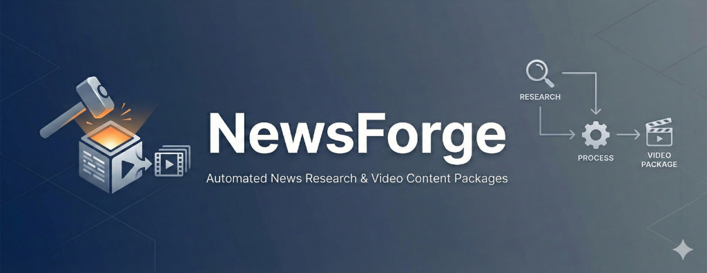

# NewsForge

An AI-powered news aggregation and research desktop application built with Electron, React, and TypeScript.

## 🎯 Overview

NewsForge is a local-first desktop application designed to streamline news research and content creation workflows. It aggregates news from multiple sources (RSS feeds, Gmail, YouTube, websites), uses AI to compile and analyze information, and exports curated content packages for further use.

### Key Features

- **Multi-Source Aggregation**: Collect news from RSS feeds, Gmail newsletters, YouTube channels, and websites
- **AI-Powered Compilation**: Automatically group and summarize related headlines using LLM technology
- **Content Package Creation**: Generate YouTube-ready content with titles, descriptions, and script outlines
- **Obsidian Integration**: Export archives directly to your Obsidian vault for long-term knowledge management
- **Local-First**: All data stored locally in SQLite for privacy and offline access
- **Token Tracking**: Monitor AI usage and costs with built-in analytics

## 🛠️ Tech Stack

- **Frontend**: React 18 + TypeScript + Tailwind CSS + shadcn/ui
- **Desktop**: Electron 33
- **Database**: SQLite + Drizzle ORM
- **AI**: LangChain + Claude/GPT integration
- **Build**: Vite + electron-builder
- **Testing**: Playwright + Vitest

## 📋 Prerequisites

- Node.js >= 16.0.0
- npm or pnpm

## 🚀 Quick Start

### Installation

```sh
# Clone the repository
git clone https://github.com/geckogtmx/news-forge.git

# Navigate to project directory
cd news-forge

# Install dependencies
npm install
```

### Development

```sh
# Start the development server
npm run dev
```

This will launch the Electron app with hot-reload enabled for both the main process and renderer.

### Building

```sh
# Build for production
npm run build
```

The built application will be available in the `release` directory.

### Testing

```sh
# Run unit tests
npm test

# Run end-to-end tests (requires build)
npm run pretest
npm test
```

## 📂 Project Structure

```
news-forge/
├── electron/                   # Electron main process code
│   ├── main/                   # Main process source
│   │   ├── db/                 # Database schema and connection
│   │   ├── index.ts            # Main entry point
│   │   └── update.ts           # Auto-updater logic
│   └── preload/                # Preload scripts
├── src/                        # React renderer process
│   ├── components/             # Reusable UI components
│   ├── pages/                  # Application pages/routes
│   ├── contexts/               # React contexts
│   ├── hooks/                  # Custom React hooks
│   └── lib/                    # Utilities and helpers
├── public/                     # Static assets
├── build/                      # Application icons
└── drizzle/                    # Database migrations
```

## 🔄 Workflow

1. **Configure Sources**: Add RSS feeds, Gmail filters, YouTube channels, or websites
2. **Start a Run**: Initiate news collection from all active sources
3. **Review Headlines**: Browse and select relevant raw headlines
4. **AI Compilation**: Let AI group related stories and generate summaries
5. **Create Content**: Generate content packages with titles, descriptions, and outlines
6. **Export**: Archive to Obsidian or export for content creation

## 🗄️ Database Schema

NewsForge uses SQLite with the following main tables:

- `users` - User profiles and authentication
- `newsSources` - Configured news sources
- `runs` - Workflow execution tracking
- `rawHeadlines` - Collected news items
- `compiledItems` - AI-generated compilations
- `contentPackages` - Export-ready content
- `runArchives` - Historical data and Obsidian exports
- `userSettings` - User preferences and configuration

## ⚙️ Configuration

### Setting up News Sources

1. Navigate to **Sources** page
2. Click **Add Source**
3. Configure source type (RSS, Gmail, YouTube, Website)
4. Set topics and filters
5. Activate the source

### Obsidian Integration

1. Go to **Settings**
2. Set your Obsidian vault path
3. Configure export format preferences
4. Archives will automatically export to your vault

### AI Model Configuration

Configure your preferred LLM in Settings:
- Default: Claude 3.5 Sonnet
- Supports OpenAI GPT models
- Token usage tracking included

## 🔐 Security

- All data stored locally on your machine
- No cloud sync (by design)
- API keys stored securely in user data directory
- Context isolation enabled in production builds

## 🐞 Debugging

The project includes VSCode debug configurations:

1. Open in VSCode
2. Set breakpoints in your code
3. Press F5 to start debugging
4. DevTools automatically open in development mode

## 📝 License

MIT License - see [LICENSE](LICENSE) file for details

## 🤝 Contributing

This is a personal project, but suggestions and feedback are welcome via GitHub issues.

## 🔗 Links

- [Repository](https://github.com/geckogtmx/news-forge)
- [Issue Tracker](https://github.com/geckogtmx/news-forge/issues)

---

**Status**: 🚧 Active Development - Core features in progress
